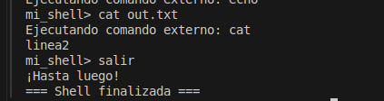

## Mini-Shell (SO-Proyecto)

Pequeña shell en C++ que ejecuta comandos en modo foreground, con soporte para redirección, pipes, comandos internos y (opcional) navegación por historial con flechas usando GNU Readline.

### Requerimientos
- Linux
- Compilador C++17 (g++)
- Opcional para flechas: `libreadline-dev` (Ubuntu/Debian)

### Compilación y ejecución
- Modo básico (sin flechas):
  ```bash
  ./build.sh
  ./src/mi_shell
  ```
- Modo con flechas (Readline):
  ```bash
  ./build.sh readline
  ./src/mi_shell
  ```
  Si falta la dependencia:
  ```bash
  sudo apt-get install -y libreadline-dev
  ```

### Características implementadas

Base:
- Prompt personalizado y lectura de comandos.
- Resolución de rutas: absoluta tal cual; si no, fallback a `/bin/<cmd>` con verificación de permisos.
- Ejecución con procesos: `fork()` en hijo + `execv()`, padre espera con `waitpid()`.
- Manejo de errores con `perror/errno` y reporte si termina por señal.
- Redirección de salida `>` (crea/trunca, sin imprimir en pantalla).
- Salida con `salir`/`exit`.

Extensiones (2+):
- Pipes simples: `cmd1 | cmd2`.
- Comandos internos (built-ins): `cd`, `pwd`, `help`, `history`, `alias`.
- Opcional: navegación de historial con flechas (Readline) en modo interactivo.

Pendientes/Parcial:
- Background `&`: lanza sin esperar, falta recolección diferida (SIGCHLD/WNOHANG) para evitar zombies.
- Redirección `<` y `>>` (parser listo, falta integrar en ejecución).
- Señales, hilos (parallel), meminfo: no implementados.

### Ejemplos de uso

Sesión básica:
```bash
mi_shell> pwd
mi_shell> alias ll='ls -la'
mi_shell> ll
mi_shell> history
mi_shell> salir
```

Pipes y redirección:
```bash
mi_shell> ls | grep cpp
mi_shell> echo hola > out.txt
```

Con flechas (Readline):
- Usa flecha arriba/abajo para navegar comandos ya escritos.
- Edición de línea (Ctrl+A/Ctrl+E) y borrado interactivo.

---

### Capturas

- Prompt personalizado
  - 
- Resolución de rutas
  - 
- Ejecución mediante procesos
  - 

- Manejo de errores
  - 
- Redirección de salida estándar (>)
  - 

- Comando de salida
  - 
- Pipes
  - 
- Comandos internos (built-ins)
  - 

---

### Notas de desarrollo (Gitflow breve)
- Trabajar en ramas `feature/*` y abrir PR hacia `develop`.
- Evitar commits directos en `main`/`develop`.
- Mantener feature actualizada con `git fetch` + `git rebase origin/develop` antes del PR.